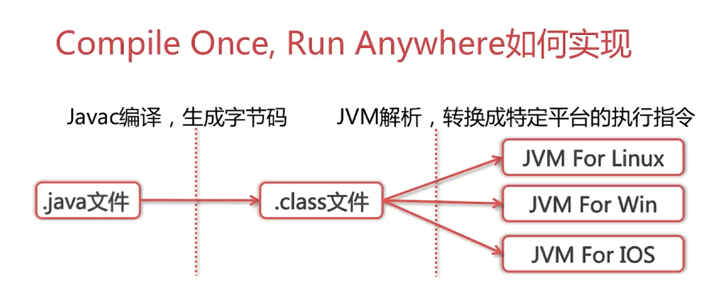
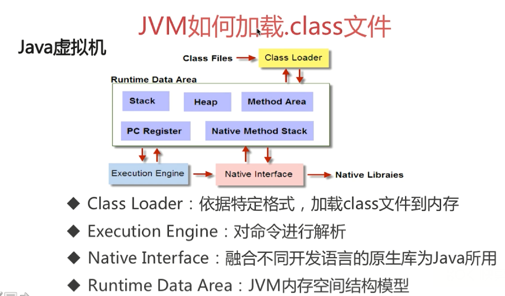
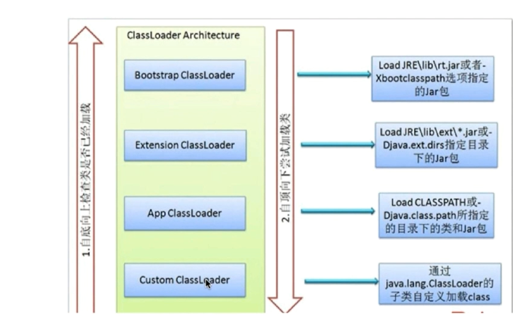
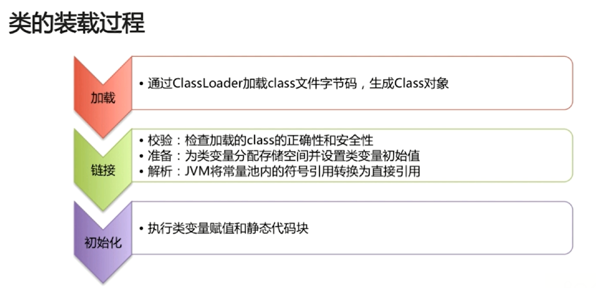
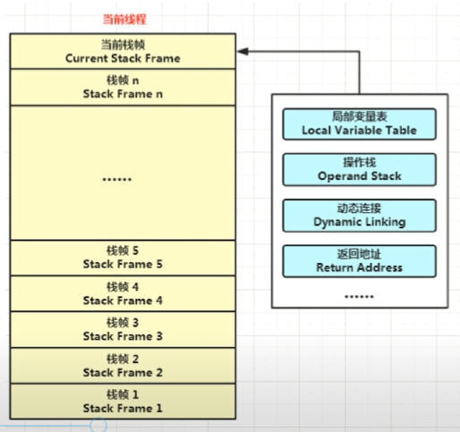
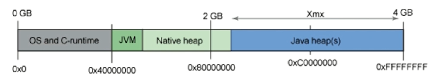
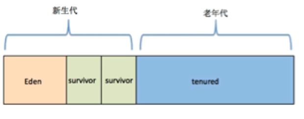
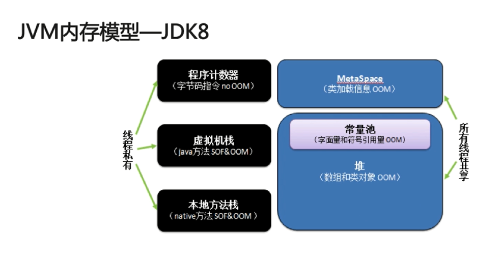
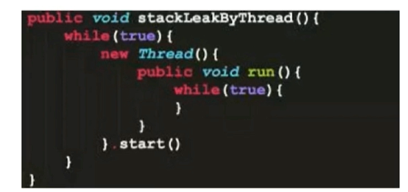

### JVM相关

- **java如何做到一次编译，到处运行？(跨平台)**

  

java源码首先被编译成字节码，再由不同的平台的JVM进行解析，java语言在不同的平台上运行时不需要重新进行编译，Java虚拟机在进行字节码的时候，把字节码转换成具体平台上的机器指令

- **JVM如何加载.class文件**

  - jvm的组成

    

  - Class Loader的作用
  
    classloader在Java中有着非常重要的作用，它主要工作在Class装载的加载阶段，其主要作用是从系统外0部获得Class二进制流。它是Java的核心组件，所有的Class都是由ClassLoader加载的，ClassLoader主要将Class文件里的二进制数据流装载进系统，然后交给Java虚拟机进行连接，初始化等操作。
  
  - ClassLoader的分类
  
    1. BootStrapClassLoader：C++编写,加载核心内库java.*
    2. ExtClassLoader:java编写，加载扩展库javax.*
    3. AppClassLoader:java编写，加载程序所在的目录
    4. 自定义ClassLoader:Java编写，定制化加载
  
  - ClassLoader的双亲委派机制
  
     

  - 为什么要使用双亲委派机制去加载类?
  
    1. 避免多份同样的字节码加载
    
    2. .使用双亲委派模型的好处在于Java类随着它的类加载器一起具备了一种带有优先级的层次关系。例如类java.lang.Object，它存在在rt.jar中，无论哪一个类加载器要加载这个类，最终都是委派给处于模型最顶端的Bootstrap ClassLoader进行加载，因此Object类在程序的各种类加载器环境中都是同一个类。相反，如果没有双亲委派模型而是由各个类加载器自行加载的话，如果用户编写了一个java.lang.Object的同名类并放在ClassPath中，那系统中将会出现多个不同的Object类，程序将混乱。因此，如果开发者尝试编写一个与rt.jar类库中重名的Java类，可以正常编译，但是永远无法被加载运行
    
    
  
- 类加载的方式:
  
    1. 隐式加载:new
    2. 显示加载：loadClass,forName等
       - Class.forName得到的class是已经初始化完成的
       - ClassLoader.loadClass得到的class是还没有链接的
  
  - 类的装载过程:
  
    

- **java内存模型**

  - 线程私有:程序计数器，虚拟机栈，本地方法栈
    - 程序计数器:当前线程所执行的字节码行号指示器(逻辑)
    - java虚拟机栈:java方法执行的内存模型，包含多个栈帧
    - 本地方法栈:与虚拟机栈相似，主要作用于标注了native的方法 
  - 线程共享:MetaSpace,Java堆
  - 元空间:我们所说的方法区只是JVM的一种规范，而元空间是方法区的实现，JDK8以前是用永久代，而JDK8之后用元空间替代了永久代，并且JDK7以后原先位于方法区里的字符串常量池移动到了Java堆中。
      - 元空间与永久代的区别：
      - **元空间使用的是本地内存，而永久代使用的是JVM的内存**，这样改变的最大的一个好处就是java.lang.OutOfMemoryError这个异常将不复存在了，因为默认的元数据分配大小只受本地内存大小的限制了,不过这个分配也不是无限大，jvm会动态的设置其大小。
        - 字符串常量池存在永久代中，容易出现性能问题和内存溢出
        - 类和方法的信息大小难以确定，给永久代的大小指定带来困难
        - 永久代会为GC带来不必要的复杂性
        - 方便HotSpot与其他JVM如Jrockit的集成
    - Java堆(Heap):
      - 对象实例的分配区域
      - GC管理的主要区域
  
  
  
  - 递归为什么会引发java.lang.StackOverflowError异常?
  
    - 递归过深，栈帧数超出虚拟机栈深度(限制递归的次数，用循环替换递归)
  
  - 虚拟机栈过多会引发java.lang.OutOfMemoryError异常
  
    - 如图:
  
    

  - JVM三大性能调优参数 -Xms -Xmx -Xss 的含义
  
    - -Xss：规定了每个线程虚拟机栈(堆栈)的大小
    - -Xms:堆的初始大小
    - -Xmx:堆能达到的最大值
  
  - Java内存模型中堆和栈的区别
  
    - 管理方式：栈自动释放，堆需要GC
    - 空间大小:栈比堆小
    - 碎片相关:栈产生的碎片远小于堆
    - 分配方式:栈支持静态和动态分配，而堆只支持动态分配
    - 效率:栈的效率比堆要高
  
  - JDK6和JDK6以后版本的intern()方法的区别:
  
    >String s=new String("abc")
    >
    >s.intern();
    >
    >
  
    - JDK6:当调用Intern（）方法时，如果字符串常量池之前已经创建了该字符串对象，则返回该池中字符串的引用。否则，将此字符串对象添加到字符串常量池中，并且返回该字符串对象的引用。
    - JDK6+：当调用Intern()方法时，如果字符串常量池之前已经创建了该字符串对象，则返回该池中的该字符串的引用。否则，如果该字符串对象已经存在Java堆中，则将该堆中字符串的引用添加到字符串常量池中，并且返回该引用，如果堆中不存在，则在池中创建该字符串并返回其引用。

 