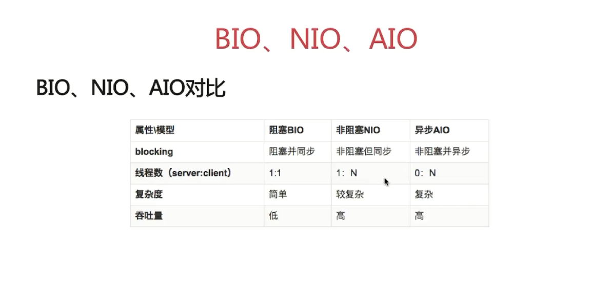

#                   java基础笔记

-------

1. [java集合类](#java集合类)
2. [多线程](#多线程)
3. [异常与IO流](异常与IO流)
4. [java语言基础](java语言基础)

​                                               

###  java集合类

- **Collection**(单列集合)

  - List(有序的，可重复的，可为null)
    - ArrayList:线程不安全，查询速度快，底层是数组来维护的。
    - LinkedList:线程不安全，增删改快，底层链表来维护的。
    - Vector:线程安全，但速度慢，已被ArrayList替代，底层是数组维护的。
  - Set(无序的，不可重复的)
    - HashSet：HashSet按照hash算法来存取元素的，具有很好的存取和查找性能。当向HashSet中存取元素时，会根据经过hash算法得到这个元素的hashcode值存储在对应的位置。
      - LinkedHashSet(LikedHashSet是HashSet的子类，它也是根据元素的HashCode值进来决定元素的存储位置，但它能够同时使用链表来维护元素的添加次序)
    - SortedSet
      - TreeSet:不重复且有序，底层通过TreeMap实现，值按照升序排列。
  - Queue
    - LinkedList:(基于双向链表实现，实现了List接口，Deque接口)

- **Map**(双列集合)

  - hashMap
  - weakhashMap
  - SortedMap
    - TreeMap(基于红黑树实现，按升序排列Key)

- **如图所示**

   

​            **这个看起来可能有点复杂，你可以看如下这张图，可能更清晰一点(一些常用的)**

​             

- **ArrayList，LinkedList和Vetor的实现原理与区别**

  1. 从线程安全方面比较

     - ArrayList 不具有线程安全性，用在单线程环境中。LinkedList 也是线程不安全的，如果在并发环境下使用它们，可以用 Colletions 类中的静态方法 synchronizedList()对ArrayList 和 LinkedList 进行调用即可。Vector 是线程安全的，即它的大部分方法都包含有关键字 synchronized。Vector 的效率没有 ArrayList 和 LinkedList 高。

  2. 从扩容机制方面考虑

     -   从内部实现机制来讲，ArrayList 和 Vector 都是使用 Object 的数组形式来存储的。若容量不够，ArrayList 扩容后的容量是之前的 1.5 倍(初始值为10)，然后把之前的数据通过Array.copyOf()拷贝到新建的数组。Vector 默认情况下扩容后的容量是之前的 2 倍。Vector可以 通过capacityIncrement设置容量增量，而 ArrayList不可以。

       ​     **可变长度数组的原理：当元素个数超过数组的长度时，会产生一个新数组，将原数组的数据复制到新数组，再将新的元素添加到新数组中。**

  3.  效率对比	
  
     ​    ArrayList 和 Vector 中，从指定的位置（用 index）检索一个对象，或在集合的末尾插入、删除一个对象的时间是一样的，可表示为 O(1)。但是，如果在集合的其他位置增加或移除元素那么花费的时间是 O（n）。LinkedList 中，在插入、删除集合中任何位置的元素所花费的时间都是O(1)，但它在索引一个元素的时候比较慢 O（n）。所以，如果只是查找特定位置的元素或只在集合的末端增加、移除元素，那么使用Vector 或 ArrayList 都可以。如果是对其它指定位置的插入、删除操作，最好选择 LinkedList。 
  
- **集合中的** **fail-fast** **机制 **

  ​    假设存在两个线程（线程1、线程 2），线程1通过Iterator在遍历集合A中的元素，在某个时候线程2修改了集合 A 的结构（是结构上面的修改，而不是简单的修改集合元素的内容），那么这 个时候程序就会抛出ConcurrentModificationException异常，从而产生fail-fast机制。

  ​    产生的原因：当调用容器的iterator()方法返回 Iterater 对象时，把容器中包含对象的个数赋值给了一个变量 expectedModCount,在调用 next（）方法时，会比较expectedModCount 与容器中实际对象的个数是否相等，若二者不相等，则抛出ConcurrentModificationException 异常。如果在遍历集合的同时，需要删除元素的话，可以用 iterator 里面的remove()方法删除元素。在遍历的时候不要修改结构，除非使用迭代器的remove方法(删除当前迭代的方法)。

- **hashmap实现原理**

  ​        HashMap的主干是一个Entry数组。Entry（Entry是HashMap中的一个静态内部类，既是数组元素又是链表的头节点）是HashMap的基本组成单元，每一个Entry包含一个key-value键值对以及一个指向链表下一结点的指针。**简单来说，HashMap由数组+链表组成的，数组是HashMap的主体，链表则主要为了解决哈希冲突而存在的，如果定位到的数组位置不含链表（当前entry的next指向null）,那么对于查找，添加等操作很快，仅需一次寻址即可；如果定位到的数组包含链表，对于添加操作，其时间复杂度为O(n)，首先遍历链表，存在即覆盖，否则新增；对于查找操作来讲，仍需遍历链表，然后通过key对象的equals方法逐一比对查找。所以，性能考虑，HashMap中的链表出现越少，性能才会越好**

  

**put方法的实现：1.**对key做null检查。如果key是null，会被存储到table[0]，因为null的hash值总是0。

2.调用key的hashcode()方法，并计算hash值。**hash值用来找到存储Entry对象的数组的索引**。

3.如果两个key有相同的hash值(也叫冲突)，他们会以链表的形式来存储。

4· 如果在刚才计算出来的索引位置没有元素，直接把Entry对象放在那个索引上。

5· 如果索引上有元素，然后会进行迭代，一直到Entry->next是null。当前的Entry对象变成链表的下一个节点。

6.在迭代的过程中，会调用equals()方法来检查key的相等性，如果这个方法返回true，它就会用当前Entry的value来替换之前的value。

**get方法的实现**：1.对key进行null检查。如果key是null，table[0]这个位置的元素将被返回。

2.key的hashcode()方法被调用，然后计算hash值，根据hash值查询要获取的Entry对象在table数组中的精确的位置。

3.在获取了table数组的索引之后，会迭代链表，调用equals()方法检查key的相等性，如果equals()方法返回true，get方法返回Entry对象的value，否则，返回null。

**hashMap是2的整数次幂的原因：**如果数组进行扩容，数组长度会发生变化，而存储位置 index = h&(length-1),index也可能会发生变化，需要重新计算index，这样会保证index-1低位全为1，而扩容后只有一位差异，也就是多出了最左位的1，这样在通过 h&(length-1)的时候，只要h对应的最左边的那一个差异位为0，就能保证得到的新的数组索引和老数组索引一致。

**hashMap线程不安全的体现：**在多线程情况下，会导致hashmap出现链表闭环，一旦进入了闭环get数据，程序就会进入死循环，所以导致HashMap是非线程安全的。

**JDK1.7中**

使用一个Entry数组来存储数据，用key的hashcode取模来决定key会被放到数组里的位置，如果hashcode相同，或者hashcode取模后的结果相同（hash collision），那么这些key会被定位到Entry数组的同一个格子里，这些key会形成一个链表。在hashcode特别差的情况下，比方说所有key的hashcode都相同，这个链表可能会很长，那么put/get操作都可能需要遍历这个链表，时间复杂度在最差情况下会退化到O(n)。

**JDK1.8中**

使用一个Node数组来存储数据，但这个Node可能是链表结构，也可能是红黑树结构；如果插入的key的hashcode相同，那么这些key也会被定位到Node数组的同一个格子里。如果同一个格子里的key不超过8个，使用链表结构存储。如果超过了8个，那么会调用treeifyBin函数，将链表转换为红黑树。那么即使hashcode完全相同，由于红黑树的特点，查找某个特定元素，也只需要O(log n)的开销。也就是说put/get的操作的时间复杂度最差只有O(log n)。

- **currenthashmap原理**

   ConcurrentHashMap与HashMap相比，最关键的是要理解一个概念：**segment**。 Segment其实就是一个Hashmap 。Segment也包含一个HashEntry数组，数组中的每一个HashEntry既是一个键值对，也是一个链表的头节点。 Segment对象在ConcurrentHashMap集合中有2的N次方个，共同保存在一个名为**segments的数组**当中。

  

ConcurrentHashMap是一个双层哈希表。在一个总的哈希表下面，有若干个子哈希表。优势主要在于： **每个segment的读写是高度自治的，segment之间互不影响**。这称之为“锁分段技术”。不同的segment可以并发的写入，相同的segment只允许一个线程进行操作。

**ConcurrentHashMap的具体读写：**

**Get方法：**

1.为输入的Key做Hash运算，得到hash值。

2.通过hash值，定位到对应的Segment对象。

3.再次通过hash值，定位到Segment当中数组的具体位置。

**Put方法：**

1.为输入的Key做Hash运算，得到hash值。

2.通过hash值，定位到对应的Segment对象。

3.获取可重入锁。

4.再次通过hash值，定位到Segment当中数组的具体位置。

5.插入或覆盖HashEntry对象。

6.释放锁。

- HashTable原理

  Put方法：

   1.判断value是否为空，为空则抛出异常

2. 计算 key 的 hash 值，并根据 hash 值获得 key 在 table 数组中的位置 index，如果 table[index] 元素不为空，则进行迭代，如果遇到相同的 key，则直接替换，并返回旧 value
3. 否则，我们可以将其插入到 table[index] 位置。

Get方法:

相比较于 put 方法，get 方法则简单很多。其过程就是首先通过 hash()方法求得 key 的哈希值，然后根据 hash 值得到 index 索引（上述两步所用的算法与 put 方法都相同）。然后迭代链表，返回匹配的 key 的对应的 value；找不到则返回 null。

Hashtable 与 HashMap 的简单比较:

1. HashTable 基于 Dictionary 类，而 HashMap 是基于 AbstractMap。Dictionary 是任何可将键映射到相应值的类的抽象父类，而 AbstractMap 是基于 Map 接口的实现，它以最大限度地减少实现此接口所需的工作。
2. HashMap 的 key 和 value 都允许为 null，而 Hashtable 的 key 和 value 都不允许为 null。HashMap 遇到 key 为 null 的时候，调用 putForNullKey 方法进行处理，而对 value 没有处理；Hashtable遇到 null，直接返回 NullPointerException。
3. Hashtable 是同步的，而HashMap则不是。所以有人一般都建议如果是涉及到多线程同步时采用 HashTable，没有涉及就采用 HashMap，但是在 Collections 类中存在一个静态方法：synchronizedMap()，该方法创建了一个线程安全的 Map 对象，并把它作为一个封装的对象来返回。

**锁分段技术**

​    HashTable容器在竞争激烈的并发环境下表现出效率低下的原因，是因为所有访问HashTable的线程都必须竞争同一把锁，那假如容器里有多把锁，每一把锁用于锁容器其中一部分数据，那么当多线程访问容器里不同数据段的数据时，线程间就不会存在锁竞争，从而可以有效的提高并发访问效率，这就是**ConcurrentHashMap所使用的锁分段技术，首先将数据分成一段一段的存储，然后给每一段数据配一把锁，当一个线程占用锁访问其中一个段数据的时候，其他段的数据也能被其他线程访问。有些方法需要跨段，比如size()和containsValue()，它们可能需要锁定整个表而不仅仅是某个段，这需要按顺序锁定所有段，操作完毕后，又按顺序释放所有段的锁。**这里“按顺序”是很重要的，否则极有可能出现死锁，在ConcurrentHashMap内部，段数组是final的，并且其成员变量实际上也是final的，但是，仅仅是将数组声明为final的并不保证数组成员也是final的，这需要实现上的保证。这可以确保不会出现死锁，因为获得锁的顺序是固定的.

**ConcurrentHashMap 1.7与1.8的区别**

改进一：取消segments字段，直接采用transient volatile HashEntry<K,V>[] table保存数据，采用table数组元素作为锁，从而实现了对每一行数据进行加锁，进一步减少并发冲突的概率。

改进二：将原先table数组＋单向链表的数据结构，变更为table数组＋单向链表＋红黑树的结构。对于hash表来说，最核心的能力在于将key hash之后能均匀的分布在数组中。

**WeakHashMap<K,V>** 

​    弱引用是用来描述非必需对象的，被弱引用关联的对象只能生存到下一次垃圾收集发生之前，当垃圾收集器工作时，无论当前内存是否足够，都会回收掉只被弱引用关联的对象，因此如果没有强引用来引用WeakHashMap<K,V>中的entry，则在GC时将会被清除。

**HashSet**

​    **对于 HashSet 而言，它是基于 HashMap 实现的，HashSet 底层使用HashMap 来保存所有元素**，因此HashSet的实现比较简单，相关 HashSet 的操作，基本上都是直接调用底层 HashMap 的相关方法来完成。**HashSet 中的元素都存放在 HashMap 的 key 上面，而 value 中的值都是统一的一个 private static final Object PRESENT = new Object();**

### 异常与IO流

- 异常:

  - 异常机制

    

Throwable又派生出Error类和Exception类。

**错误**：Error类以及他的子类的实例，代表了JVM本身的错误。错误不能被程序员通过代码处理，Error很少出现。因此，程序员应该关注Exception为父类的分支下的各种异常类。

**异常**：Exception以及他的子类，代表程序运行时发送的各种不期望发生的事件。可以被Java异常处理机制使用，是异常处理的核心。

**非检查异常**：Error 和 RuntimeException 以及他们的子类。javac在编译时，不会提示和发现这样的异常，不要求在程序处理这些异常。对于这些异常，我们应该修正代码，而不是去通过异常处理器处理 。这样的异常发生的原因多半是代码写的有问题。如除0错误ArithmeticException，错误的强制类型转换错误ClassCastException，数组索引越界ArrayIndexOutOfBoundsException，使用了空对象NullPointerException等等。

**检查异常**：除了Error 和 RuntimeException的其它异常。javac强制要求程序员为这样的异常做预备处理工作（使用try…catch…finally或者throws）。在方法中要么用try-catch语句捕获它并处理，要么用throws子句声明抛出它，否则编译不会通过。这样的异常一般是由程序的运行环境导致的。因为程序可能被运行在各种未知的环境下，而程序员无法干预用户如何使用他编写的程序，于是程序员就应该为这样的异常时刻准备着。如SQLException , IOException,ClassNotFoundException 等。

**常见的Exception和Error**

  

​    **java异常中try-catch-finally的的执行顺序**

1. finally语句在return语句执行之后return返回之前执行的。
2. finally块中的return语句会覆盖try块中的return返回。
3. 如果finally语句中没有return语句覆盖返回值，那么原来的返回值可能因为finally里的修改而改变也可能不变
4. try块里的return语句在异常的情况下不会被执行，这样具体返回哪个看情况。
5. 当发生异常后，catch中的return执行情况与未发生异常时try中return的执行情况完全一样。 
   finally块的语句在try或catch中的return语句执行之后返回之前执行且finally里的修改语句可能影响也可能不影响try或catch中 return已经确定的返回值，若finally里也有return语句则覆盖try或catch中的return语句直接返回。

- **IO流**

   **IO流机制**

    

**BIO   NIO   AIO的区别**

 IO的方式通常分为几种，同步阻塞的BIO、同步非阻塞的NIO、异步非阻塞的AIO。

一、BIO

​     在JDK1.4出来之前，我们建立网络连接的时候采用BIO模式，需要先在服务端启动一个ServerSocket，然后在客户端启动Socket来对服务端进行通信，默认情况下服务端需要对每个请求建立一堆线程等待请求，而客户端发送请求后，先咨询服务端是否有线程相应，如果没有则会一直等待或者遭到拒绝请求，如果有的话，客户端会线程会等待请求结束后才继续执行。

二、NIO

​    NIO本身是基于事件驱动思想来完成的，其主要想解决的是BIO的大并发问题： 在使用同步I/O的网络应用中，如果要同时处理多个客户端请求，或是在客户端要同时和多个服务器进行通讯，就必须使用多线程来处理。也就是说，将每一个客户端请求分配给一个线程来单独处理。这样做虽然可以达到我们的要求，但同时又会带来另外一个问题。由于每创建一个线程，就要为这个线程分配一定的内存空间（也叫工作存储器），而且操作系统本身也对线程的总数有一定的限制。如果客户端的请求过多，服务端程序可能会因为不堪重负而拒绝客户端的请求，甚至服务器可能会因此而瘫痪。

​    NIO基于Reactor，当socket有流可读或可写入socket时，操作系统会相应的通知引用程序进行处理，应用再将流读取到缓冲区或写入操作系统。  也就是说，这个时候，已经不是一个连接就要对应一个处理线程了，而是有效的请求，对应一个线程，当连接没有数据时，是没有工作线程来处理的。

   BIO与NIO一个比较重要的不同，是我们使用BIO的时候往往会引入多线程，每个连接一个单独的线程；而NIO则是使用单线程或者只使用少量的多线程，每个连接共用一个线程。

​        NIO的最重要的地方是当一个连接创建后，不需要对应一个线程，这个连接会被注册到多路复用器上面，所以所有的连接只需要一个线程就可以搞定，当这个线程中的多路复用器进行轮询的时候，发现连接上有请求的话，才开启一个线程进行处理，也就是一个请求一个线程模式。

​      在NIO的处理方式中，当一个请求来的话，开启线程进行处理，可能会等待后端应用的资源(JDBC连接等)，其实这个线程就被阻塞了，当并发上来的话，还是会有BIO一样的问题。

　　HTTP/1.1出现后，有了Http长连接，这样除了超时和指明特定关闭的http header外，这个链接是一直打开的状态的，这样在NIO处理中可以进一步的进化，在后端资源中可以实现资源池或者队列，当请求来的话，开启的线程把请求和请求数据传送给后端资源池或者队列里面就返回，并且在全局的地方保持住这个现场(哪个连接的哪个请求等)，这样前面的线程还是可以去接受其他的请求，而后端的应用的处理只需要执行队列里面的就可以了，这样请求处理和后端应用是异步的.当后端处理完，到全局地方得到现场，产生响应，这个就实现了异步处理。

三、AIO

​     与NIO不同，当进行读写操作时，只须直接调用API的read或write方法即可。这两种方法均为异步的，对于读操作而言，当有流可读取时，操作系统会将可读的流传入read方法的缓冲区，并通知应用程序；对于写操作而言，当操作系统将write方法传递的流写入完毕时，操作系统主动通知应用程序。  即可以理解为，read/write方法都是异步的，完成后会主动调用回调函数。  在JDK1.7中，这部分内容被称作NIO.2，主要在java.nio.channels包下增加了下面四个异步通道：

- AsynchronousSocketChannel
- AsynchronousServerSocketChannel
- AsynchronousFileChannel
- AsynchronousDatagramChannel

其中的read/write方法，会返回一个带回调函数的对象，当执行完读取/写入操作后，直接调用回调函数。

BIO是一个连接一个线程。

NIO是一个请求一个线程。

AIO是一个有效请求一个线程。

先来个例子理解一下概念，以银行取款为例： 

- 同步 ： 自己亲自出马持银行卡到银行取钱（使用同步IO时，Java自己处理IO读写）；
- 异步 ： 委托一小弟拿银行卡到银行取钱，然后给你（使用异步IO时，Java将IO读写委托给OS处理，需要将数据缓冲区地址和大小传给OS(银行卡和密码)，OS需要支持异步IO操作API）；
- 阻塞 ： ATM排队取款，你只能等待（使用阻塞IO时，Java调用会一直阻塞到读写完成才返回）；
- 非阻塞 ： 柜台取款，取个号，然后坐在椅子上做其它事，等号广播会通知你办理，没到号你就不能去，你可以不断问大堂经理排到了没有，大堂经理如果说还没到你就不能去（使用非阻塞IO时，如果不能读写Java调用会马上返回，当IO事件分发器会通知可读写时再继续进行读写，不断循环直到读写完成）

Java对BIO、NIO、AIO的支持：

- Java BIO ： 同步并阻塞，服务器实现模式为一个连接一个线程，即客户端有连接请求时服务器端就需要启动一个线程进行处理，如果这个连接不做任何事情会造成不必要的线程开销，当然可以通过线程池机制改善。
- Java NIO ： 同步非阻塞，服务器实现模式为一个请求一个线程，即客户端发送的连接请求都会注册到多路复用器上，多路复用器轮询到连接有I/O请求时才启动一个线程进行处理。
- Java AIO(NIO.2) ： 异步非阻塞，服务器实现模式为一个有效请求一个线程，客户端的I/O请求都是由OS先完成了再通知服务器应用去启动线程进行处理，

BIO、NIO、AIO适用场景分析:

- BIO方式适用于连接数目比较小且固定的架构，这种方式对服务器资源要求比较高，并发局限于应用中，JDK1.4以前的唯一选择，但程序直观简单易理解。
- NIO方式适用于连接数目多且连接比较短（轻操作）的架构，比如聊天服务器，并发局限于应用中，编程比较复杂，JDK1.4开始支持。
- AIO方式使用于连接数目多且连接比较长（重操作）的架构，比如相册服务器，充分调用OS参与并发操作，编程比较复杂，JDK7开始支持。

另外，I/O属于底层操作，需要操作系统支持，并发也需要操作系统的支持，所以性能方面不同操作系统差异会比较明显。

在高性能的I/O设计中，有两个比较著名的模式Reactor和Proactor模式，其中Reactor模式用于同步I/O，而Proactor运用于异步I/O操作。

​    在比较这两个模式之前，我们首先的搞明白几个概念，什么是阻塞和非阻塞，什么是同步和异步,同步和异步是针对应用程序和内核的交互而言的，同步指的是用户进程触发IO操作并等待或者轮询的去查看IO操作是否就绪，而异步是指用户进程触发IO操作以后便开始做自己的事情，而当IO操作已经完成的时候会得到IO完成的通知。而阻塞和非阻塞是针对于进程在访问数据的时候，根据IO操作的就绪状态来采取的不同方式，说白了是一种读取或者写入操作函数的实现方式，阻塞方式下读取或者写入函数将一直等待，而非阻塞方式下，读取或者写入函数会立即返回一个状态值。

 一般来说I/O模型可以分为：同步阻塞，同步非阻塞，异步阻塞，异步非阻塞IO

同步阻塞IO：在此种方式下，用户进程在发起一个IO操作以后，必须等待IO操作的完成，只有当真正完成了IO操作以后，用户进程才能运行。JAVA传统的IO模型属于此种方式！

同步非阻塞IO:在此种方式下，用户进程发起一个IO操作以后边可返回做其它事情，但是用户进程需要时不时的询问IO操作是否就绪，这就要求用户进程不停的去询问，从而引入不必要的CPU资源浪费。其中目前JAVA的NIO就属于同步非阻塞IO。

异步阻塞IO：此种方式下是指应用发起一个IO操作以后，不等待内核IO操作的完成，等内核完成IO操作以后会通知应用程序，这其实就是同步和异步最关键的区别，同步必须等待或者主动的去询问IO是否完成，那么为什么说是阻塞的呢？因为此时是通过select系统调用来完成的，而select函数本身的实现方式是阻塞的，而采用select函数有个好处就是它可以同时监听多个文件句柄，从而提高系统的并发性！

 异步非阻塞IO:在此种模式下，用户进程只需要发起一个IO操作然后立即返回，等IO操作真正的完成以后，应用程序会得到IO操作完成的通知，此时用户进程只需要对数据进行处理就好了，不需要进行实际的IO读写操作，因为真正的IO读取或者写入操作已经由内核完成了。目前Java中还没有支持此种IO模型。  

