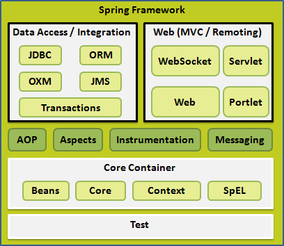
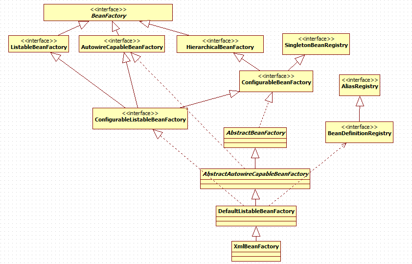
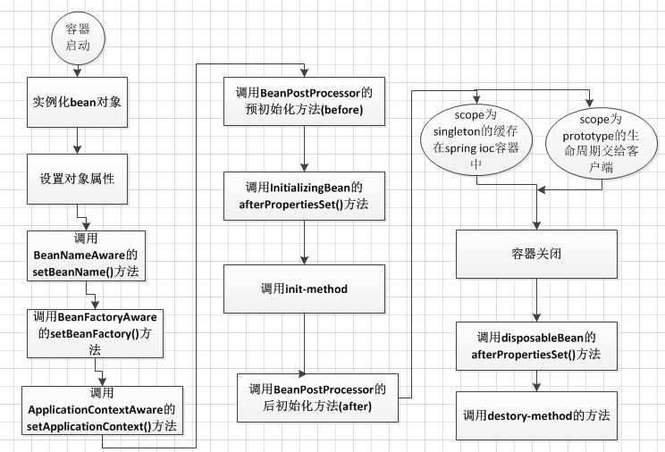
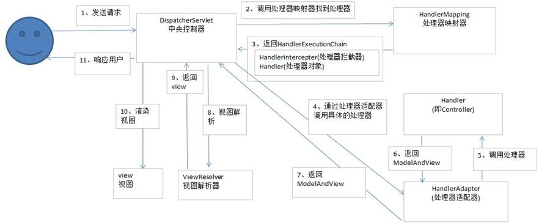

## spring学习笔记

- spring 介绍

  - Spring 框架是 Java 应用最广的框架，它的**成功来源于理念，而不是技术本身**，它的理念包括 **IoC (Inversion of Control，控制反转)** 和 **AOP(Aspect Oriented Programming，面向切面编程)**。

  - spring框架结构

      
     

- spring优点:
  - 低侵入式设计，代码污染极低
  - IOC将对象之间的依赖关系交给了spring框架处理，降低了组件之间的耦合性
  - AOP支持允许将一些通用的如安全问题，事物，日志等进行集中式管理，从而提供了更好的复用性
  - 对主流的框架也有很好的支持性

- spring IOC(控制反转)和ID(依赖注入)
  - spring IOC
    - IOC  控制反转，对象的创建控制权反转给了spring容器，以前我们创建一个对象的时候都是自己手动去new 一个对象，而引入spring之后，我们可以将这种控制权交给spring容器管理，这样有利于对象之间的松耦合，也有利于功能复用，这是一个非常优秀的理念。
    - DI  依赖注入，DI和IOC是同一个概念的不同角度去描述的，所谓的依赖注入就是应用程序依赖于IOC容器，在运行时需要IOC来动态提供对象需要的外部资源。
      - 依赖注入的常用的四种方式
        1. 构造器注入
        2. setter方法注入
        3. 接口注入
        4. 注解注入（如Autowired）
    
    - spring IOC支持的功能
                1. 依赖注入
                   2. 依赖检查
                   3. 自动装配
                   4. 支持集合
                   5. 指定初始化方法和销毁方法
                   6. 支持回调方法(需要实现spring接口)
  
- BeanFactory:spring框架最核心的接口

  - 提供IOC的配置机制

  - 包含Bean的各种定义，便于实例化Bean

  - 建立Bean之间的依赖关系

  - Bean生命周期的控制

    
  
- BeanFactory的整体体系结构

   

- **BeanFactory和ApplicationContext的区别**

  - ApplicationContext是BeanFactory的子接口
  - BeanFactory可以理解为含有bean集合的工厂类，BeanFactory包含了bena的定义，以便在接收到客户端请求时将对应的bean实例化。BeanFactory还能在实例化对象时生成协作类之间的关系。这样能将Bean自身和Bean客户端的配置中解放出来。BeanFactory还包含了bean生命周期的控制，调用客户端的初始化方法和销毁方法。从表面上看ApplicationContext和BeanFactory一样具有bean定义，bean关联关系的设置，根据请求分发bean的功能，但在此基础上，他还提供了其他的功能，如:

  > A:提供了支持国际化的文本消息
  >
  > B:统一的资源文件读取方式
  >
  > C：已在监听器中注册bean的事件

- springIOC中getBean()方法的逻辑流程
  - 转换beanName
  - 从缓存中加载实例
  - 实体化Bean
  - 检测ParentBeanFactory
  - 初始化依赖的Bean
  - 创建Bean
  
- **spring Bean的作用域**
  - singleton:spring的默认作用域，容器里拥有唯一的Bean实例
  - prototype:针对每个getBean的请求，容器都会创建一个Bean实例
  - request:会为每个Http请求创建一个Bean实例
  - session:会为每个session创建一个Bean实例
  - globalSession:会为每个全局Http Session创建一个Bean实例，该作用域仅对Portlet有效
  
- **springBean的生命周期**
  
    1. 实例化Bean
    
    2. 设置对象属性(依赖注入)
    
    3. 处理Aware接口
    
    4. BeanPostProcessor
    
    5. InitializingBean与init-method
    
    6. DisposableBean和destory-method
    
       **如图**
    
       

- **spring中单例Bean的线程安全问题**
  
  - spring框架并没有对单例Bean进行任何多线程的封装问题。关于单例bean的线程安全问题和并发问题需要开发者自行去搞定。但实际上，大部分的spring Bean并没有可变的状态(比如serview类和DAO类)，所以在某种程度上说Spring的单例bean是线程安全的。如果你的bean是有多种状态的话（比如view 和Model 对象），就需要自行保证线程安全问题。而最简单的办法就是将bean的作用域由“singleton”变更为“prototype”.
  
- **Spring AOP**

    - OOP引入了封装，继承，多态等概念来建立一种对象层次的结构，OOP允许开发者定义纵向的关系，但不适合定义横向的关系，例如日志功能。日志代码往往横向的散布在所有对象的层次中，而与它对应的对象的核心功能毫无关系对于其他类型的代码，如安全性、异常处理和透明的持续性也都是如此，这种散布在各处的无关的代码被称为横切（cross cutting），在OOP设计中，它导致了大量代码的重复，而不利于各个模块的重用。

    -    AOP技术恰恰相反，它利用一种称为"横切"的技术，将那些影响了多个类的公共行为封装到一个可重用模块，并将其命名为"Aspect"，即切面。所谓"切面"，简单说就是那些与业务无关，却为业务模块所共同调用的逻辑或责任封装起来，便于减少系统的重复代码，降低模块之间的耦合度，并有利于未来的可操作性和可维护性。

    -  使用"横切"技术，AOP把软件系统分为两个部分：**核心关注点**和**横切关注点**。业务处理的主要流程是核心关注点，与之关系不大的部分是横切关注点。横切关注点的一个特点是，他们经常发生在核心关注点的多处，而各处基本相似，比如权限认证、日志、事务。AOP的作用在于分离系统中的各种关注点，将核心关注点和横切关注点分离开来。

    - AOP的一些名词

      1. Aspect:通用功能的代码实现
      2. Target:被织入Aspect的对象
      3. Join Point:可以作为切入点的机会，所有的方法都可以视为切入点
      4. PointCut:Aspect实际被应用在的Join Point,支持正则
      5. Advice:类里的方法以及这个方法如何织入到目标方法的方法
         - Advice的种类
         - 1.前置通知(Before)
         - 2.后置通知(AfterReturning)
         - 3.异常通知(AfterThrowing)
         - 4.最终通知(After)
         - 5.环绕通知(Around)
    
  6. Weaving:AOP的实现过程
  
    - AOP的三种织入方式:
    
      1. 编译时织入:需要特殊的Java编译器，如AspectJ
      2. 类加载时织入:需要特殊的Java编译器，如AspectJ和AspectWerkz
      3. 运行时织入:Spring采用的方式，通过动态代理的方式，实现简单
      
  - AOP的实现：JDKproxy和Cglib
  
    1. 由AopProxyFactory根据AdvisedSupport对象的配置来决定
    2. 默认策略如果目标类是接口，则用JDKProxy来实现，否则用后者
    3. JDKProxy核心:InvocationHandler接口和Proxy类
    4. Cglib:以继承的方式动态生成目标类的代理
    5. JDKProxy:通过Java的内部反射机制实现
    6. Cglib：借助ASM实现
    7. 反射机制在生成类的过程中比较高效
    8. ASM在生成类之后的执行过程比较高效
  
  - **springAOP实现原理**
  
    **代理模式=接口+真实实现类+代理类**
    
    - spring里代理模式的生成:
      - 真实实现类里的逻辑包含在了getBean()方法里
      - getBean()方法的返回的是Proxy的实例
      - Proxy实例Spring采用JDK Proxy或CGLB动态生成
    
  - **spring的设计模式**
  
    1)工厂模式，BeanFactory用来创建对象的实例。
  
    2) 代理模式，在Aop实现中用到了JDK的动态代理。
  
    3) 单例模式，这个比如在创建bean的时候。
  
    4) 模板方法，用来解决代码重复的问题。比如. RestTemplate, JmsTemplate, JpaTemplate。
  
  
  
  ​    
  
  
  
  
  ​    

****

***

###### **SpringMVC**

1. **springMVC的工作流程**:

    

    (1). 用户发送请求至前端控制器DispatcherServlet

    (2). DispatcherServlet收到请求调用HandlerMapping处理器映射器

    (3). 处理器映射器找到具体的处理器，生成处理器对象以及处理器拦截器(如果有则生成)一并返回给DispatcherServlet

    (4). DispatcherServlet调用HandlerAdapter处理器适配器

    (5). HandlerAdapter经过适配器调用具体的处理器(也就是Controller,也叫后端控制器)

    (6). Controller执行完成后返回ModelAndView

    (7). HandlerAdapter将controller执行的结果ModelAndView返回给DispatcherServlet

    (8). DispatcherServlet将ModelAndView传给ViewReslover视图解析器

    (9).ViewReslover解析后返回具体的View

    (10).DispatcherServlet根据View进行渲染视图

    (11).DispatcherServlet响应用户

​      

2. **SpringMVC常用的注解有哪些**

   ​    @RequestMapping:用于请求url映射。

   ​    @RequestBody：注解实现接收http请求的json数据，将json转换为java对象。

   ​    @ResponseBody：注解实现将conreoller方法返回对象转化为json对象响应给客户。

3.  **springmvc的优点**

   1）可以支持各种视图技术,而不仅仅局限于JSP；

   2）与Spring框架集成（如IoC容器、AOP等）；

   3)   清晰的角色分配:前端控制器(dispatcherServlet) , 请求到处理器映射（handlerMapping),  处理器适配器（HandlerAdapter), 视图解析器（ViewResolver）。

4. **SpringMVC怎么样设定重定向和转发的，SpringMvc用什么对象从后台向前台传递数据的？**

   答：通过ModelMap对象,可以在这个对象里面用put方法,把对象加到里面,前台就可以通过el表达式拿到。

5. ​    在返回值前面加"forward:"就可以让结果转发,譬如"forward:user.do?name=method4" 在返回值前面加"redirect:"就可以让返回值重定向,譬如"redirect:http://www.baidu.com"。

6. **SpringMvc的控制器是不是单例模式,如果是,有什么问题,怎么解决？**

   答：是单例模式,所以在多线程访问的时候有线程安全问题,不要用同步,会影响性能的,解决方案是在控制器里面不能写字段。

7. **SpringMvc中函数的返回值是什么？**

   答：返回值可以有很多类型,有String, void,ModelAndView，但一般用String比较好。

8. **注解原理**

   　　注解本质是一个继承了Annotation的特殊接口，其**具体实现类是Java运行时生成的动态代理类**。而我们通过反射获取注解时，返回的是Java运行时生成的动态代理对象。通过代理对象调用自定义注解的方法，会最终调用AnnotationInvocationHandler的invoke方法。该方法会从memberValues这个Map中索引出对应的值。而memberValues的来源是Java常量池。

