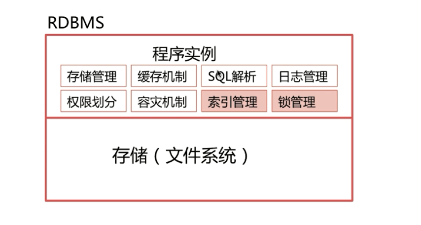
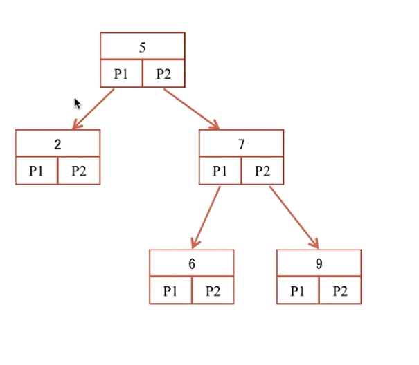
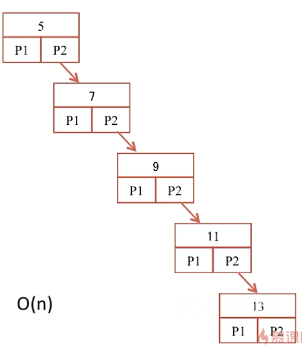
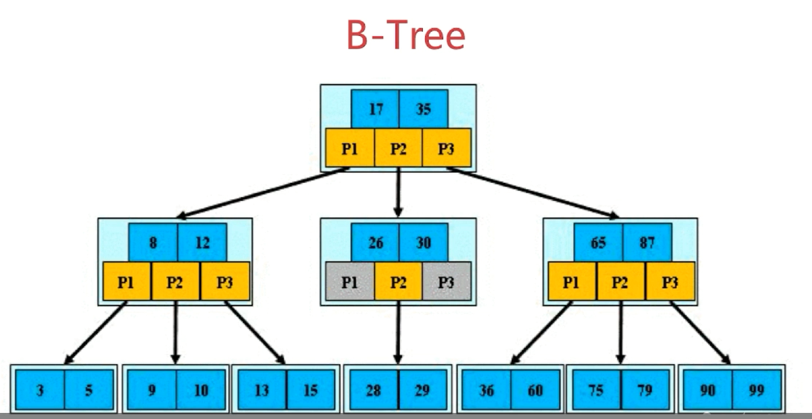
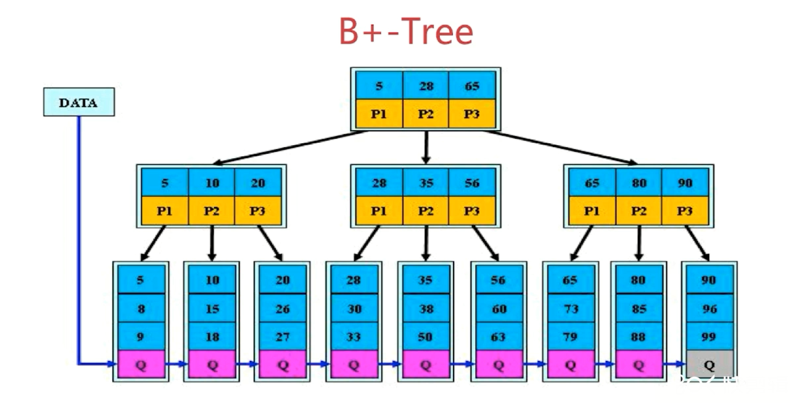
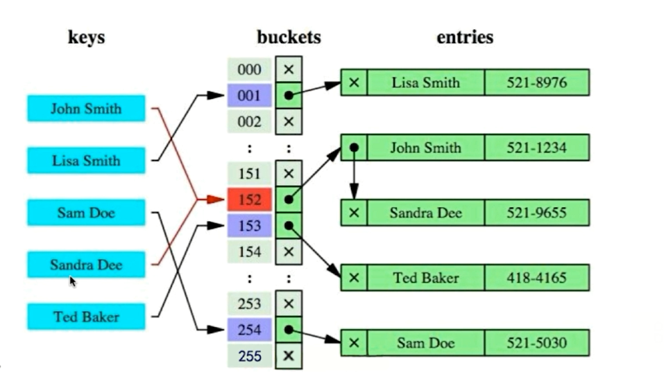
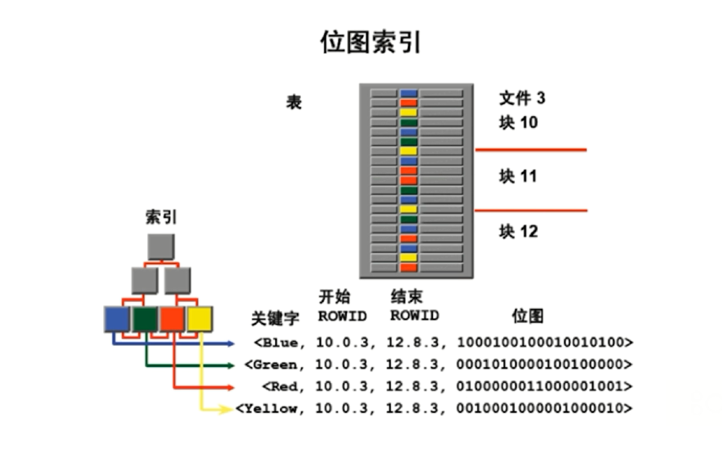

## 数据库

- **如何设计一个RDBMS(关系型数据库)-------从那几方面去考虑呢?**

  - 整体架构设计:

    1. 存储（文件系统）->将数据持久化到存储设备中，如磁盘

    2. 程序实例（对存储模块进行逻辑上的划分）: 

       
$$
       \begin{cases}
              1.存储管理\\
              2.缓存机制\\
              3.SQL解析\\
              4.日志管理\\
              5.权限划分\\
              6.容灾机制\\
              7.索引管理\\
              8.锁管理\\
            \end{cases}
$$

- 如图:

  

- **索引模块**

  - 为什么要使用索引?

    - 快速查询数据

  - 什么样的信息能成为索引?

    - 主键，唯一键以及普通键等

  - 索引的数据结构

    - 生成索引,建立二叉查找树进行二分查找
    - 生成索引,建立B-Tree结构进行查找
    - 生成索引,建立B+-Tree结构进行查找
    - 生成索引,建立Hash结构进行查找

    1. **二叉查找树**

       - 如图：每个节点有两个孩子节点(左子树上的值都大于父亲节点的值，右子树上的值都大于父亲节点的值)

         

基于二分查找法查找时间复杂度为O(logn),但是当你发生删除或者增加节点后，时间复杂度可能会恶化到O(n)

如图:

 例如删除了2和6节点，增加了11和13节点之后变为:

 

可能就会有人说我们可以利用树的一个特性即旋转让其保持平衡二叉树(**它是一棵空树或它的左右两个子树的高度差的绝对值不超过1，并且左右两个子树都是一棵平衡二叉树**)级别的时间复杂度,即O(logn)。但是如果数据量一大，当你要去查找一个位于很后面的数据的时候，但同时你不管是平衡二叉树或者红黑树都要进行多次的IO操作，这样一来检索性能就很差，那么怎么能又让其时间复杂度和查找效率都尽量最优呢?这个时候我们就可以想到B树了一个父亲节点不只有两个孩子节点。

2. **B-Tree**

   - 定义:

     1. 根节点至少包过两个孩子

     2. 树中每个节点最多含有m个孩子(m>=2),其中m取决于数据库容量和相关配置。

     3. 除了根节点和叶子节点外，其他每个节点至少含有ceil(m/2)个孩子

     4. 所有的叶子节点位于同一层

     5. 每个非终端结点中包含有n个关键字信息： (n，P0，K1，P1，K2，P2，......，Kn，Pn)。其中：
               a)   Ki (i=1...n)为关键字，且关键字按顺序升序排序K(i-1)< Ki。 
               b)   Pi为指向子树根的接点，且指针P(i-1)指向子树种所有结点的关键字均小于Ki，但都大于

        K(i-1)。 
               c)   关键字的个数n必须满足： [ceil(m / 2)-1]<= n <= m-1

   如果每个节点最多有m个孩子，那么这样的树就叫m阶B树，如图是一个3阶B树

   

3. **B+-Tree**

   B+树是B树的变体，其定义基本与B树相同，除了:

   - 非叶子节点的子树指针与关键字个数相同

   - 非叶子节点的子树指针P[i]，指向关键字值(k[i],k[i+1])的子树

   - 非叶子节点仅用来做索引，数据都保存在叶子节点中

   - 所有的叶子节点均有一个链指针指向下一个叶子节点

     

**结论:B+树更适合用来做存储索引**

1. B+树的磁盘读写代价更低
2. B+树的查询效率更加稳定
3. B+树更有利于对数据库的扫描

**Hash索引**

如图我们可以将所要查找的内容全部加载到内存中去

那么既然hash索引时间复杂度都是O(1)级别这么高效的，为什么主流数据库使用的索引是B+树而不是hash索引呢

hash索引的缺点:

       1. 仅仅能满足“=”,"IN"这种的，不能使用范围查询
       2. 无法被用来避免数据的排序操作
       3. 不能利用部分索引键查询
       4. 不能避免表扫描
       5. 遇到大量Hash值相等的情况后性能不一定就会比B-Tree索引高

**BitMap位图索引**

 

缺点是加锁的力度太大，通常要新增或者修改一条数据的时候，通常和他位于同一层的数据操作都会被锁住。